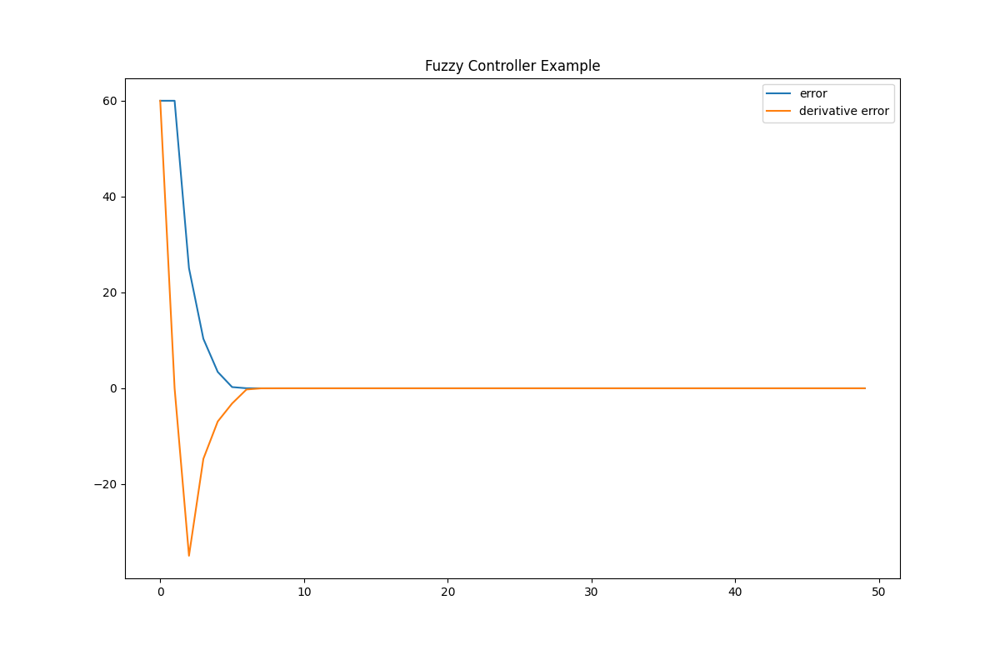
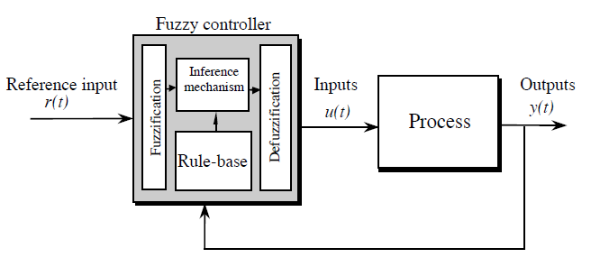

# :rocket:`ZJUER:` Basic Fuzzy Logic Controller

Realize the basic function of fuzzy logic controller. User can select _Triangle_, _Rectangle_, _Trapezoid_, _Gaussian_ membership functions to do fuzzification. _Centroid (COG)_ method is used to defuzzification.

## Schedule
- [x] The main body of the program is completed
- [x] Bugs have been fixed
- [x] Add an example. Visualization uses`matplotlib-cpp` wrapper. [lava/matplotlib-cpp](https://github.com/lava/matplotlib-cpp) provides this support
- [ ] Interface and logic optimization
- [ ] Protection checker
- [ ] `README.md` update

## Example Usage
Compile the project once you download this repository.

```shell {.line-numbers}
git clone https://github.com/HangX-Ma/fuzzy-logic-controller.git
cd fuzzy-logic-controller
mkdir build && cd build
cmake ..
cmake --build .
```
After you run the executable file, the following result will show on terminal and you can find `example.png` in share folder.

```shell {.line-numbers}
------------ Information of fuzzy logic controller ------------
Universal discourse [err]: [-100.000000, 100.000000]  
Universal discourse [err_dev]: [-65.000000, 65.000000]
Universal discourse [u]: [-50.000000, 50.000000]
Kp_e=0.030000, Kd_e=0.046154, Kp_u=16.666667
```

## Fuzzy Logic Control Basic Concept
Fuzzy logic controller is composed of the following four elements:
1. *A rule-base* (a set of If-Then rules), which contains a fuzzy logic quantification of the expert’s linguistic description of how to achieve good control.
2. *An inference mechanism* (also called an “inference engine” or “fuzzy inference” module), which emulates the expert’s decision making in interpreting and applying knowledge about how best to control the plant.
3. *A fuzzification interface*, which converts controller inputs into information that the inference mechanism can easily use to activate and apply rules.
4. *A defuzzification interface*, which converts the conclusions of the inference mechanism into actual inputs for the process.




## LICENSE
Apache License Version 2.0

## REF
> _Fuzzy Control_, Kevin M. Passino, Stephen Yurkovich, Department of Electrical Engineering, The Ohio State University  
> [fuzzylite/fuzzylite](https://github.com/fuzzylite/fuzzylite)  
> [shuoyueqishi/fuzzy-controller](https://github.com/shuoyueqishi/fuzzy-controller)  

