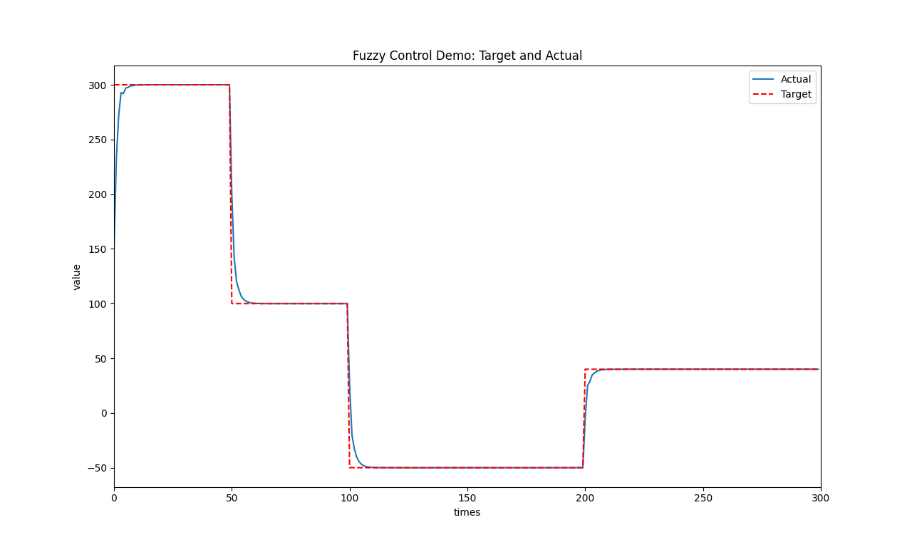
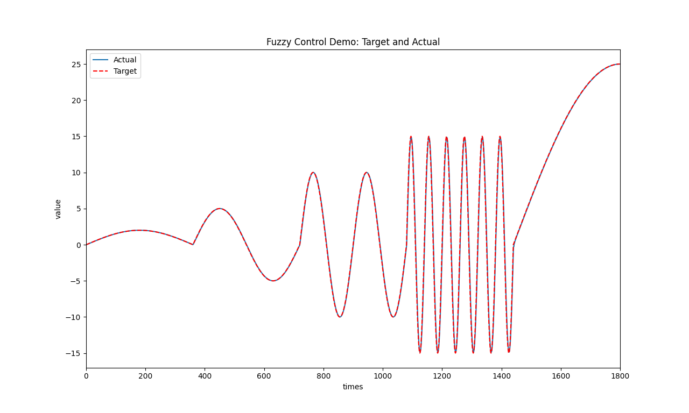
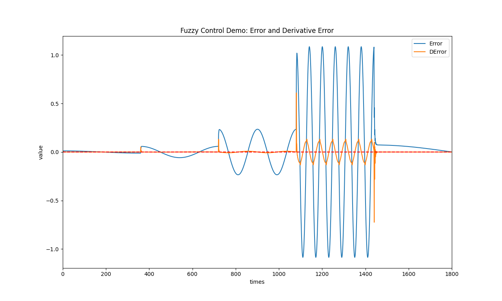

# A fuzzy logic controller

Realize the basic function of fuzzy logic controller. User can select _Triangle_, _Trapezoid_, _Gaussian_ membership functions to do **fuzzification**. The **inference** process will select the highest weight rule, if exist some rules that points to the same output discourse. _Centroid (COG)_ method is used to **defuzzification**.

## Environment

- Python3.11, matplotlib-3.7.1
- Eigen-3.4.0
- matplotlib-cpp
- C++17, CMake 3.23

## Schedule

- [x] Rewrite the core logic and fix the essential fuzzy logic problems.
- [x] Uses [lava/matplotlib-cpp](https://github.com/lava/matplotlib-cpp) wrapper to do visualization.
- [x] Refactor code following [Google C++ open source project style guide](https://zh-google-styleguide.readthedocs.io/en/latest/google-cpp-styleguide/contents/).

## Usage

Compile the project after you download this repository. You can find the output executable file in `build/bin`.

```shell
git clone https://github.com/HangX-Ma/fuzzy-logic-controller.git
cd fuzzy-logic-controller
cmake -B build -S .
cmake --build build
```

This repository only provide three membership functions: _Triangle_, _Trapezoid_, _Gaussian_. You need to provide your configuration parameters by yourself.

<table>
<tr>
    <td></td>
    <td></td>
    <td></td>
</tr>
<tr>
    <td align="center"><font size="2" color="#999"><u>Membership function: Triangle, HangX-Ma</u></font></td>
    <td align="center"><font size="2" color="#999"><u>Membership function: Trapezoid, HangX-Ma</u></font></td>
    <td align="center"><font size="2" color="#999"><u>Membership function: Gaussian, HangX-Ma</u></font></td>
</tr>
</table>

You can annotate these definitions in `CMakeLists.txt` to switch off/on those relative functions.

```cmake
# CMakeLists.txt
add_definitions(
    "-DFC_USE_DOUBLE"
    "-DFC_USE_MATPLOTLIB"
    "-DFC_USE_DEBUG_MSG"
    "-DFC_USE_INFO_MSG"
)
```

## Demo

<div align="center">
    
    <br>
    <font size="2" color="#999"><u>Fuzzy control surface, HangX-Ma</u></font>
    <br></br>
</div>

```bash
[INFO]Fuzzy logic controller info:
[INFO]=> discourse e:  [-100.000, 100.000]
[INFO]=> discourse ec: [-50.000, 50.000]
[INFO]=> discourse u:  [-30.000, 30.000]
[INFO]=> error quantifying factor [Ke]:             0.0700
[INFO]=> derivative error quantifying factor [Kec]: 0.1400
[INFO]=> output scaling factor [Ku]:                8.5714
```

<table>
<tr>
    <td></td>
    <td></td>
</tr>
<tr>
    <td align="center"><font size="2" color="#999"><u>FC Demo - Constant: Target and Actual, HangX-Ma</u></font></td>
    <td align="center"><font size="2" color="#999"><u>FC Demo - Constant: Error and Derivative Error, HangX-Ma</u></font></td>
</tr>
</table>

<table>
<tr>
    <td></td>
    <td></td>
</tr>
<tr>
    <td align="center"><font size="2" color="#999"><u>FC Demo - Sine: Target and Actual, HangX-Ma</u></font></td>
    <td align="center"><font size="2" color="#999"><u>FC Demo - Sine: Error and Derivative Error, HangX-Ma</u></font></td>
</tr>
</table>

## Fuzzy Logic Control Basic Concept

Fuzzy logic controller is composed of the following four elements:

1. A _**rule-base**_ (a set of If-Then rules), which contains a fuzzy logic quantification of the expert’s linguistic description of how to achieve good control.
2. An _**inference mechanism**_ (also called an “inference engine” or “fuzzy inference” module), which emulates the expert’s decision making in interpreting and applying knowledge about how best to control the plant.
3. A _**fuzzification interface**_, which converts controller inputs into information that the inference mechanism can easily use to activate and apply rules.
4. A _**defuzzification interface**_, which converts the conclusions of the inference mechanism into actual inputs for the process.

<div align="center">
    
    <br>
    <font size="2" color="#999"><u>Fuzzy controller architecture, HangX-Ma</u></font>
</div>

## Reference

- [Fuzzy Control](share/FCbook.pdf), Kevin M. Passino, Stephen Yurkovich, Department of Electrical Engineering, The Ohio State University
- [fuzzylite/fuzzylite](https://github.com/fuzzylite/fuzzylite)
- [shuoyueqishi/fuzzy-controller](https://github.com/shuoyueqishi/fuzzy-controller)

## License

MIT License
